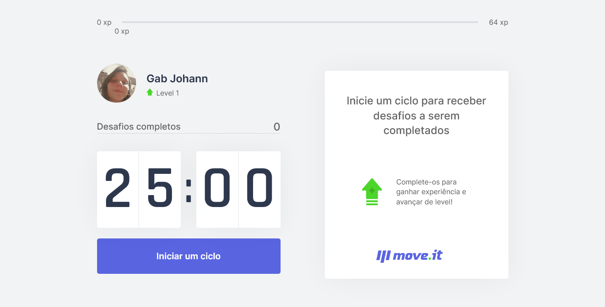

 <a href="#--sobre">Sobre</a> 
 <a href="#--funcoes">Funções</a> •
 <a href="#--como-utilizar-a-aplicacao">Como utilizar a aplicação</a> •
 <a href="#--tecnologias-utilizadas">Tecnologias utilizadas</a> 

 
## :page_facing_up: Sobre

Este projeto é um cronômetro que utiliza a técnica de [pomodoro](https://pt.wikipedia.org/wiki/T%C3%A9cnica_pomodoro), ao final de cada ciclo o usuário recebe um exercício como desafio, esses desafios tem como intuito diminuir a ocorrência de lesões por movimentos repetitivos. 

A aplicação foi desenvolvida durante a **NLW#04 - trilha de ReactJS**, oferecida pela [**Rocketseat**](https://rocketseat.com.br/),  ao longo dos cinco dias de maratona. 

## :dart: Funções

A aplicação solicita uma permissão para envio de notificações, que deve ser dada pelo usuário, sua objetivo é notificar o usuário o fim do ciclo. 
Além desta notificação sonora, há uma notificação visual. 

Quando o ciclo de foco se encerra, é informado um desafio e sua pontuação, caso o usuário o realize esses pontos serão somados o levando ao próximo nível, caso contrário, o level e o número de experiência permanecerá o mesmo.

A cada avanço de nível é exibido um modal com o novo nível alcançado. Caso haja atualização na página, as informações serão recuperadas através dos cookies.

## :space_invader: Como utilizar a aplicação

### Pré-requisitos

Você precisa ter instalado na sua máquina:
* [Node.js](https://nodejs.org/en/)
* [VSCode](https://code.visualstudio.com/) - editor de código recomendado

## Executando a aplicação

### Clone este repositório :octocat:

``git clone https://github.com/gabjohann/move.it-NLW-04.git``

### Acesse a pasta do projeto via terminal

``cd move.it-NLW-04``

### Instale as dependências

**npm** -> ``npm install`` ou **yarn** -> ``npm install -g yarn``

### Execute a aplicação

**npm** -> ``npm run dev`` ou **yarn** -> ``yarn dev``

Acesse: http://localhost:3000, para abrir a aplicação.

## 💻 Tecnologias utilizadas

### Aplicação

A aplicação foi desenvolvida utilizando:
• [ReactJS](https://pt-br.reactjs.org/) 
• [Next.js](https://nextjs.org/) 
• [TypeScript](https://www.typescriptlang.org/) 
•  [js-cookie](https://github.com/js-cookie/js-cookie)

### Ferramentas

• Editor de código -> [VSCode](https://code.visualstudio.com/)
• Fontes -> [Inter](https://fonts.google.com/specimen/Inter) & [Rajdhani](https://fonts.google.com/specimen/Rajdhani)

### Hospedagem

• [Vercel](https://vercel.com/)

## 📝 Licença

Esse projeto está sob a licença MIT. Veja o arquivo [LICENSE](https://github.com/gabjohann/move.it-NLW-04/blob/main/LICENSE) para mais detalhes. 

#### Observação:

Este Read.md foi baseado no que o [@Guilherme Capitão](https://github.com/guilhermecapitao) desenvolveu.  
Veja o dele aqui [READ.md](https://github.com/guilhermecapitao/nlw-04-reactjs-moveit)
